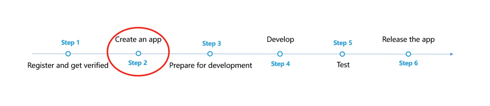

# Ads Kit (HMS)

## Service Introduction

HUAWEI Ads Kit leverages Huawei devices and Huawei's extensive data capabilities to provide you with the Publisher Service, helping you monetize traffic. Meanwhile, it provides the advertising service for advertisers to deliver personalized campaigns or commercial ads to Huawei device users.The video on this page introduces traffic monetization through HUAWEI Ads Kit and the process for advertisers to display ads.You can click [here](https://developer.huawei.com/consumer/en/training/detail/101582707399567035) to watch the MOOC video about Ads Kit.

### HUAWEI Ads Publisher Service

HUAWEI Ads Publisher Service is a monetization service that leverages Huawei's extensive data capabilities to display high quality ad content in your apps to the vast user base of Huawei devices.

We offer a range of ad formats including [Banner Ads](https://developer.huawei.com/consumer/en/doc/development/HMSCore-Guides-V5/publisher-service-banner-0000001050066915-V5), [Native Ads](https://developer.huawei.com/consumer/en/doc/development/HMSCore-Guides-V5/publisher-service-native-0000001050064968-V5), [Rewarded Ads](https://developer.huawei.com/consumer/en/doc/development/HMSCore-Guides-V5/publisher-service-reward-0000001050066917-V5), [Interstitial Ads](https://developer.huawei.com/consumer/en/doc/development/HMSCore-Guides-V5/publisher-service-interstitial-0000001050064970-V5), [Splash Ads](https://developer.huawei.com/consumer/en/doc/development/HMSCore-Guides-V5/publisher-service-splash-0000001050066919-V5), and [Roll Ads](https://developer.huawei.com/consumer/en/doc/development/HMSCore-Guides-V5/publisher-service-instream-0000001058253743-V5) so you can choose whichever that suits your app best. You can use the HUAWEI Ads SDK to integrate HUAWEI Ads into your app. Once you have chosen an ad format, you are ready to start bringing in revenue using our high-quality advertising services.

We also offer the [Publisher Service Reporting API](https://developer.huawei.com/consumer/en/doc/development/HMSCore-Guides-V5/reporting-api-dev-process-0000001051294727-V5) for you to obtain traffic monetization report data, including the number of ad requests, number of returned ads, click-through rate, and impression rate.

### Identifier Service

Ads Kit provides the open advertising identifier (OAID) and install referrer capabilities for advertisers to deliver personalized ads and attribute conversions.

- An OAID is a non-permanent device identifier. You can use OAIDs to provide personalized ads for users while protecting their privacy. In addition, third-party tracking platforms can provide conversion attributions for advertisers based on OAIDs.

- You and advertisers can obtain app install referrers through APIs provided by Huawei. Advertisers can use install referrers to attribute conversions to different promotion channels.

### Use Cases

- HUAWEI Ads Publisher Service

  HUAWEI Ads offers a range of ad formats, as listed in the following table, to best suit your app's requirements in various scenarios. 

  | <div style="width:100px">Ad Format</div>                     | Ad Type                           | Description                                                  |
  | ------------------------------------------------------------ | --------------------------------- | ------------------------------------------------------------ |
  | [Banner Ads](https://developer.huawei.com/consumer/en/doc/development/HMSCore-Guides-V5/publisher-service-banner-0000001050066915-V5) | Image                             | A banner ad is presented as a bar or block at the top, middle, or bottom of the screen within an app with high visibility for users who use the app regularly or for a long time. |
  | [Native Ads](https://developer.huawei.com/consumer/en/doc/development/HMSCore-Guides-V5/publisher-service-native-0000001050064968-V5) | Image or video                    | A native ad fits seamlessly into the surrounding content to match your app design. |
  | [Rewarded Ads](https://developer.huawei.com/consumer/en/doc/development/HMSCore-Guides-V5/publisher-service-reward-0000001050066917-V5) | Video                             | A rewarded ad is displayed when a user achieves a level, gets respawned, obtains items, bonus points, or opportunities to continue, or upgrades skills in a game. |
  | [Interstitial Ads](https://developer.huawei.com/consumer/en/doc/development/HMSCore-Guides-V5/publisher-service-interstitial-0000001050064970-V5) | Image or video                    | An interstitial ad is displayed when a user starts, pauses, loads, or exits a game or streaming media, achieves a game level, or is redirected in a game or streaming media. |
  | [Splash Ads](https://developer.huawei.com/consumer/en/doc/development/HMSCore-Guides-V5/publisher-service-splash-0000001050066919-V5) | Static image, GIF image, or video | A splash ad is displayed in full screen for 3s immediately when an app is launched. Then the ad will be automatically closed and the app home screen will be displayed. |
  | [Roll Ads](https://developer.huawei.com/consumer/en/doc/development/HMSCore-Guides-V5/publisher-service-instream-0000001058253743-V5) | Image or video                    | Pre-roll: displayed before the video content.Mid-roll: displayed in the middle of the video content.Post-roll: displayed after the video content or several seconds before the video content ends. |

- Identifier service

  The identifier service can be used by the advertising platforms, developers, third-party tracking platforms, and advertisers in different scenarios. For details, please refer to [Use Cases](https://developer.huawei.com/consumer/en/doc/development/HMSCore-Guides-V5/identifier-service-use-cases-0000001050064978-V5).

## Integrating into Your Unreal Project

### Register and get verified

Before doing this step, you need to create an HMS Account, project and App according to [the HMS document](https://developer.huawei.com/consumer/en/doc/development/HMS-Guides/Preparations).


Now you have your Huawei HMS Project and App information.

### Create an app

Create an app by referring to [Creating a Project](https://developer.huawei.com/consumer/en/doc/development/AppGallery-connect-Guides/agc-get-started#createproject) and [Creating an App in the Project](https://developer.huawei.com/consumer/en/doc/development/AppGallery-connect-Guides/agc-get-started#createapp). Set the following parameters as described:
- Platform: Select Android
- Device: Select Mobile phone
- App category: Select App or Game




The integrating process is as follows


Refer to [Sign the agreement](https://developer.huawei.com/consumer/en/doc/distribution/monetize/registration-0000001061752683) to sign the Huawei Ads Publisher Service Agreement.

If your app has been or will be released on AppGallery, follow to [Adding an App Released on Huawei AppGallery](https://developer.huawei.com/consumer/en/doc/distribution/monetize/addmedia-0000001051201919).
If your app is released on Google Play, add it by referring to [Adding an App Released on Google Play](https://developer.huawei.com/consumer/en/doc/distribution/monetize/addmedia-gp-0000001149967192).
If your app has been released on both AppGallery and Google Play and the package names are the same, select AppGallery as the app source.
**Notice**: If your app package changes on other app stores, update it in a timely manner on HUAWEI Ads Publisher Console. Otherwise, traffic monetization will be affected.

Refer to [Adding/Enabling an Ad Unit](https://developer.huawei.com/consumer/en/doc/distribution/monetize/addunit-0000001051321846) to obtain your ad unit ID

### Prepare for development

According to [HMS integration process introduction](https://developer.huawei.com/consumer/en/codelab/HMSPreparation/index.html#6), we still need to add some configurations to the gradle files for development preparations.


**1. Install the Plugin**

   Copy and enable the Unreal Engine Plugin.

   If a `<unreal_project_directory>/Plugins` folder does not exist, create it.

   From the Huawei Ads Unreal plugin, copy the HuaweiAds folder and its contents to `<unreal_project_directory>/Plugins`.
   

   From your Unreal Editor, select **Edit -> Plugins** menu then enable the Huawei Ads Plugin.
   

**2. Package name**

   Set the package name in **Edit -> Project Settings -> Android -> APK Packaging -> Android Package Name**

   The package name is `com.${Company Name}.${Product Name}`.

   You can also complete the rest of the settings here, such as version number, icons, resolution, etc. 

   

**3. Set up plugin**

   - Sign in to [AppGallery Connect](https://developer.huawei.com/consumer/en/service/josp/agc/index.html) and click **My projects**.
   - Find your app project and click the app that needs to integrate the HMS Core SDK.
   - Go to **Project settings > General information**. In the App information area, download the `agconnect-services.json` file.
   
   - You can put the json file under `<unreal_project_directory>/Configs/AGC` as default (create the `Configs/AGC` directory if not existed) or in your own favorite path
   

## Developing with the SDK
### Supported Ad formats

 | <div style="width:100px">Ad Format</div>                     | Ad Type                           | Description                                                  |
  | ------------------------------------------------------------ | --------------------------------- | ------------------------------------------------------------ |
  | [Banner Ads](https://developer.huawei.com/consumer/en/doc/development/HMSCore-Guides-V5/publisher-service-banner-0000001050066915-V5) | Image                             | A banner ad is presented as a bar or block at the top, middle, or bottom of the screen within an app with high visibility for users who use the app regularly or for a long time. |
  | [Rewarded Ads](https://developer.huawei.com/consumer/en/doc/development/HMSCore-Guides-V5/publisher-service-reward-0000001050066917-V5) | Video                             | A rewarded ad is displayed when a user achieves a level, gets respawned, obtains items, bonus points, or opportunities to continue, or upgrades skills in a game. |
  | [Interstitial Ads](https://developer.huawei.com/consumer/en/doc/development/HMSCore-Guides-V5/publisher-service-interstitial-0000001050064970-V5) | Image or video                    | An interstitial ad is displayed when a user starts, pauses, loads, or exits a game or streaming media, achieves a game level, or is redirected in a game or streaming media. |
  
  Another ad formats will be supported in the future.

### Developing

#### Using Blueprint
The below functions are supported with Blueprint
- `loadBannerAd`
- `showBannerAd`
- `hideBannerAd`
- `destroyBannerAd`
- `loadInterstitialAd`
- `showInterstitialAd`
- `loadRewardAd`
You can refer to the [Blueprint sample](Blueprint/HuaweiAdsBlueprint.uasset).


#### Using C++ APIs
Access the Huawei Ads APIs by including the header file `Ads.h` in the related classes of your project.

```C++
#include "Ads.h"
```

- Loading the banner ad

```C++
huawei::Ads::loadBannerAd("testw6vs28auh3", BannerPosition::POSITION_BOTTOM, BannerSize::BANNER_SIZE_320_100);
```

You can refer to the following banner position and banner size enum defintions

```C++
enum BannerPosition
{
    POSITION_CUSTOM = -1,
    POSITION_TOP = 0,
    POSITION_BOTTOM = 1,
    POSITION_TOP_LEFT = 2,
    POSITION_TOP_RIGHT = 3,
    POSITION_BOTTOM_LEFT = 4,
    POSITION_BOTTOM_RIGHT = 5,
    POSITION_CENTER = 6
};

enum BannerSize
{
    USER_DEFINED,
    BANNER_SIZE_320_50,
    BANNER_SIZE_320_100,
    BANNER_SIZE_468_60,
    BANNER_SIZE_DYNAMIC,
    BANNER_SIZE_728_90,
    BANNER_SIZE_300_250,
    BANNER_SIZE_SMART,
    BANNER_SIZE_160_600,
    BANNER_SIZE_360_57,
    BANNER_SIZE_360_144
};
```

- Show the banner ad

Banner ad will be shown automatically after finishing loading but you can use this function to show it on demand

Sample code
```C++
huawei::Ads:showBannerAd();
```

- Hide the banner ad

Sample code
```C++
huawei::Ads::hideBannerAd();
```

- Destroy the banner ad

Banner ad will be destroyed automatically on the `OnDestroy` lifecycle event but you can use this function to destroy it on demand

Sample code
```C++
huawei::Ads::destroyBannerAd();
```

- Load an interstitial ad


Sample code
```C++
huawei::Ads::loadInterstitialAd("testb4znbuh3n2");
```

- Show an intersitial ad

Intersitial ad will be shown automatically after finishing loading but you can use this function to show it on demand

Sample code
```C++
huawei::Ads::showInterstitialAd();
```

- Load an reward ad


Sample code
```C++
huawei::Ads::loadRewardAd("testx9dtjwj8hp");
```

- Show an reward ad

Reward ad will be shown automatically after finishing loading but you can use this function to show it on demand

Sample code
```C++
huawei::Ads::showRewardAd();
```

- Listen to callback events
Implement a listener class to receive information in all the Ads callback events

Sample code
Header file
```C++
class YourAdsListener : public huawei::AdsListener 
{
public:
    YourAdsListener();
    
    virtual void onBannerAdClosed() override;
    virtual void onBannerAdFailed(int errorCode) override;
    virtual void onBannerAdLeftApp() override;
    virtual void onBannerAdOpened() override;
    virtual void onBannerAdLoaded() override;
    virtual void onBannerAdClicked() override;
    virtual void onBannerAdImpression() override;
    virtual void onInterstitialAdClosed() override;
    virtual void onInterstitialAdFailed(int errorCode) override;
    virtual void onInterstitialAdLeftApp() override;
    virtual void onInterstitialAdOpened() override;
    virtual void onInterstitialAdLoaded() override;
    virtual void onInterstitialAdClicked() override;
    virtual void onInterstitialAdImpression() override;
    virtual void onRewardAdFailedToLoad(int errorCode) override;
    virtual void onRewardedLoaded() override;
    virtual void onRewardAdClosed() override;
    virtual void onRewardAdFailedToShow(int errorCode) override;
    virtual void onRewardAdOpened() override;
    virtual void onRewarded(const FString type, int amount) override;
}  
```

Then set it with the `setListener` API

Sample code
```C++
huawei::Ads::setListener(new YourAdsListener());
```


### Test & Release

Please refer to Huawei [Testing and Releasing your app](https://developer.huawei.com/consumer/en/doc/distribution/monetize/release-0000001050961874) for testing and releasing.


